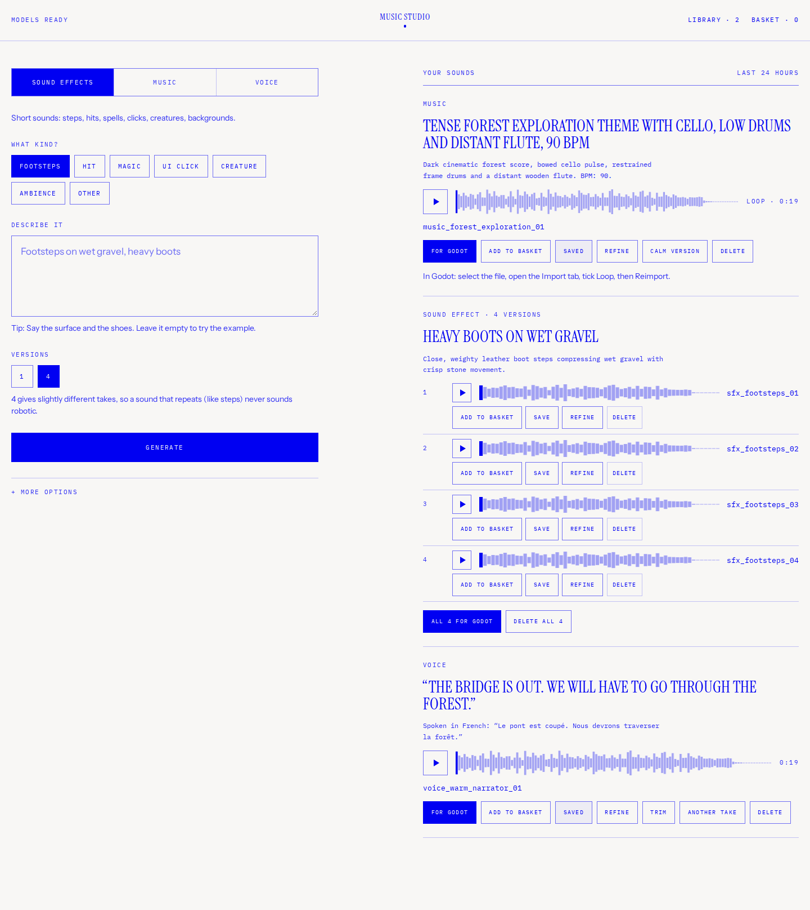
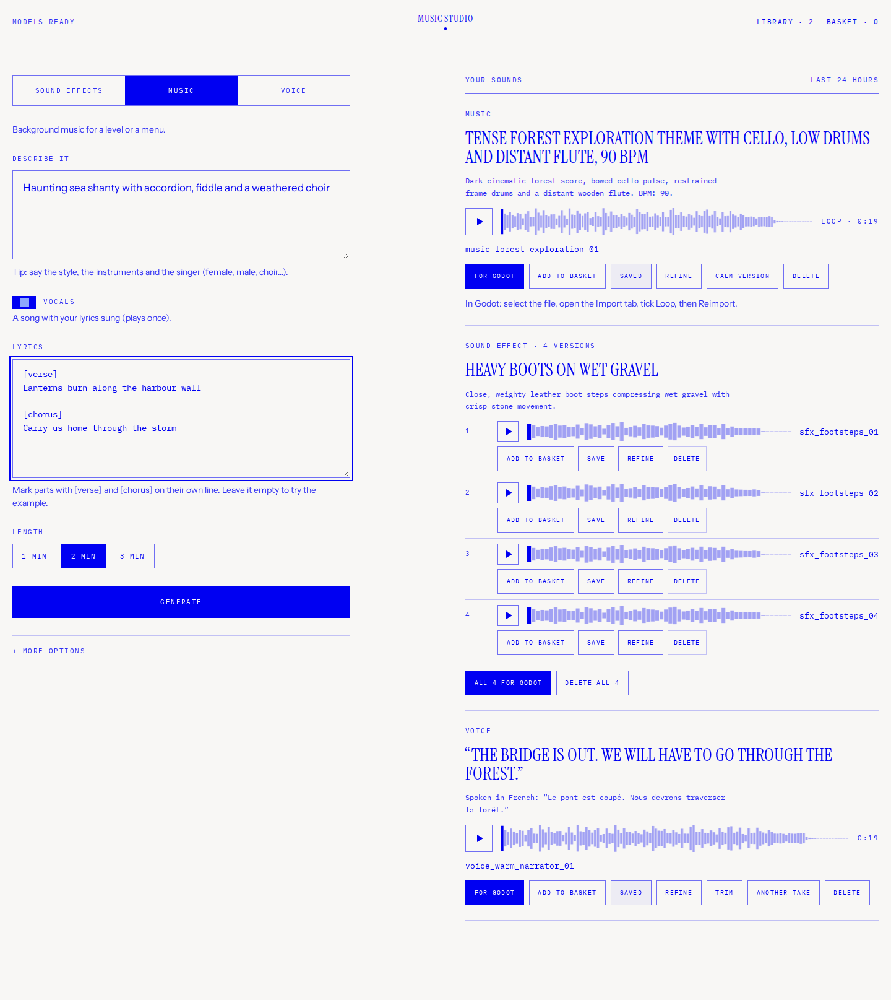
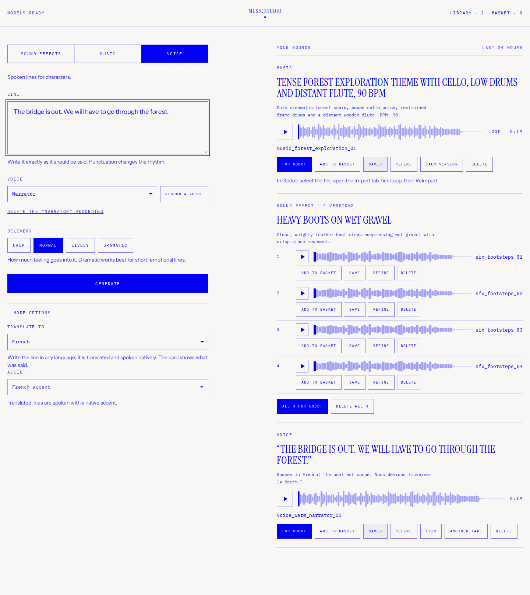
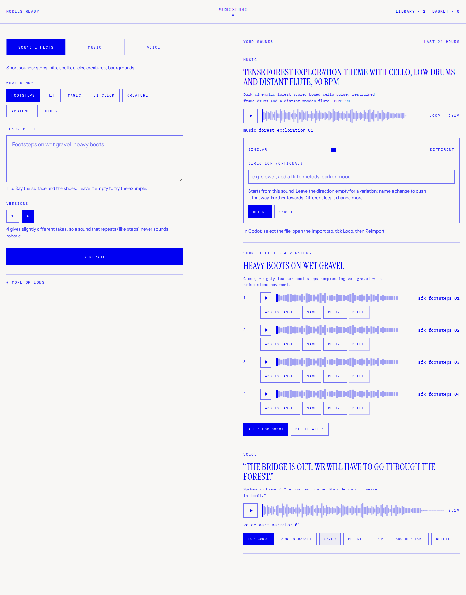
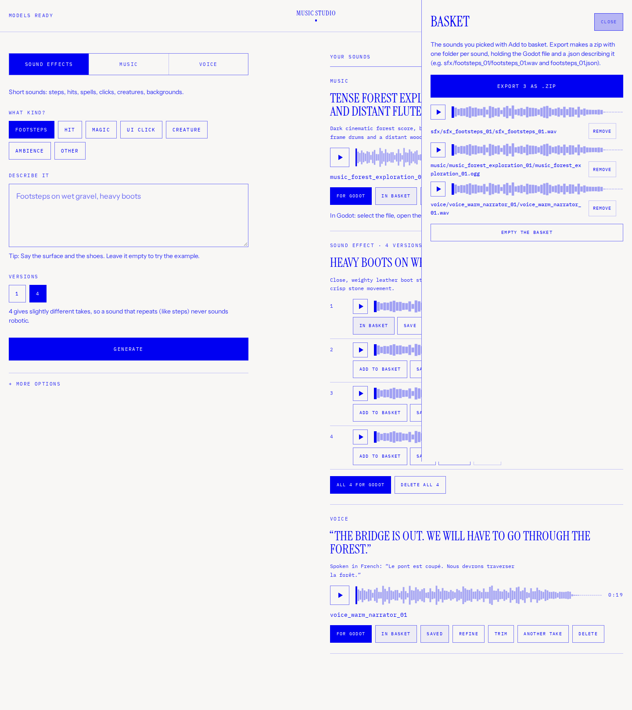

# Music Studio

Music Studio turns plain-language ideas into game-ready sound effects, seamless
music loops, songs and character voices. It runs locally: a React studio talks
to a FastAPI server, which drives ComfyUI and an optional Chatterbox speech
service. Finished files and their metadata stay on your machine.



The original sample is still included: [docs/sample.mp3](docs/sample.mp3) is a
20-second tropical-house take made with Stable Audio 3, Music mode and seed 42.

## What it makes

| Tool | Generator | Delivered file |
|---|---|---|
| Sound effects | Stable Audio 3; Footsteps, Hit, Magic, UI, Creature, Ambience or Other; one or four versions | WAV mono with silence removed and peak normalized to -1 dBFS |
| Ambience | Stable Audio 3; generated long, cut from the steady middle and crossfaded | Seamless stereo OGG at -20 LUFS |
| Instrumental music | Stable Audio 3; 30 seconds, one minute or two minutes; loop or natural ending | Stereo OGG at -16 LUFS; loops use whole bars when a BPM is available |
| Songs | ACE-Step 1.5 XL turbo; supplied lyrics, language and one-, two- or three-minute length | Stereo OGG at -16 LUFS with a natural ending |
| Character voice | Chatterbox Multilingual; preset or recorded reference voice; Calm through Dramatic delivery | Mono WAV at 44.1 kHz and -18 LUFS |

The prompt helper expands short Stable Audio prompts and shows the exact model
description on each result. A fixed seed reproduces a take. Sound-effect
versions share the same rewritten prompt and use adjacent audio seeds.



Voice lines can be spoken as written with any supported accent, or translated
first and spoken natively. Translation uses Qwen 3.5 9B; the result card records
both the original line and what was actually spoken. Chatterbox supports Arabic,
Danish, Dutch, English, Finnish, French, German, Greek, Hebrew, Hindi, Italian,
Japanese, Korean, Malay, Norwegian, Polish, Portuguese, Russian, Spanish,
Swahili, Swedish, Turkish and Chinese.



## Working with takes

Every completed take can be renamed, downloaded for Godot, saved to the local
Library, added to the Basket or permanently deleted.

- **Refine** starts from the take's own audio. Similar/Different controls remix
  strength; an optional direction can ask for changes such as “more metallic”
  or “add a flute melody.” Voice refinement re-speaks edited text with the same
  voice and a new delivery.
- **Trim** makes a new non-looping take from selected start/end points and adds
  optional fades. Loops deliberately cannot be trimmed because that would break
  their seam.
- **Calm version** remixes an instrumental loop into a quieter, sparser layer
  while reusing its exact loop cut. The server compensates Stable Audio's
  measured 2,011-sample remix lead so both layers remain aligned for adaptive
  music.
- **Basket export** creates one folder per take with the Godot-ready WAV/OGG and
  a JSON sidecar containing the prompt, model, seed, duration, loudness,
  language, voice and loop-import instructions.





## Architecture

```text
browser
  │
  ├── React + Vite (web/)
  │       local Library and Basket controls
  │
  └── FastAPI (server/, localhost:8000)
          ├── JSON metadata + audio files (server/data/, git-ignored)
          ├── ComfyUI (localhost:8188)
          │     ├── Stable Audio 3 text-to-audio and audio-to-audio
          │     ├── ACE-Step 1.5 songs and song refinement
          │     └── Qwen 3.5 prompt enhancement and translation
          ├── Chatterbox speech API (localhost:8506, optional)
          └── FFmpeg + NumPy game-audio processing
```

Jobs run asynchronously and one at a time, which makes queue order visible and
avoids loading competing audio models at once. Metadata survives restarts.
Reference audio, recordings and outputs never leave the machine.

## Requirements

- Python 3.10+, Node.js 20+ and FFmpeg on `PATH`.
- ComfyUI 0.28 or newer.
- An NVIDIA GPU is the tested path. Stable Audio 3 needs roughly 8 GB of GPU
  memory. ACE-Step XL, Qwen 9B and Chatterbox need substantially more and do not
  need to remain loaded together.
- About 15 GB for the core Stable Audio setup, or about 54 GB for all ComfyUI
  models. Chatterbox weights are separate.

## Setup

Start ComfyUI on `http://127.0.0.1:8188`, then download the core music and
sound-effect models:

```sh
scripts/download-models.sh /path/to/ComfyUI
```

To enable vocal songs and voice-line translation too, download every ComfyUI
model used by the included workflows:

```sh
scripts/download-models.sh /path/to/ComfyUI --all
```

The files are pinned to exact Hugging Face revisions. The full set adds
[ACE-Step 1.5's ComfyUI weights](https://huggingface.co/Comfy-Org/ace_step_1.5_ComfyUI_files)
and Qwen 3.5 9B. Restart ComfyUI or refresh its model list afterwards.

Install the app:

```sh
git clone https://github.com/manuelbecker123/ai-music-studio.git
cd ai-music-studio

python3 -m venv server/.venv
server/.venv/bin/pip install -r server/requirements.txt

(cd web && npm ci && npm run build)
server/.venv/bin/python server/app.py
```

Open **http://127.0.0.1:8000**. Sound effects and instrumental music now work.

Voice generation is optional. Run an
[official Chatterbox Multilingual](https://github.com/resemble-ai/chatterbox)
adapter that accepts `POST /v1/audio/speech` on port 8506. The request contains
`input`, `language`, `exaggeration`, optional `voice`, and asks for WAV.
Set `TTS_URL` when it runs elsewhere. Recorded voices are converted into
`VOICES_DIR/ms_<voice-id>.wav`; mount that same directory into the speech
service. The eight preset choices expect files named
`preset_warm_narrator.wav`, `preset_calm_narrator.wav`,
`preset_storyteller.wav`, `preset_noble_lady.wav`,
`preset_deep_warrior.wav`, `preset_old_sage.wav`,
`preset_young_hero.wav` and `preset_rogue.wav`.

### Server options

| Flag | Environment | Default | Purpose |
|---|---|---|---|
| `--comfy-url` | `COMFY_URL` | `http://127.0.0.1:8188` | ComfyUI |
| `--tts-url` | `TTS_URL` | `http://127.0.0.1:8506` | Chatterbox-compatible speech API |
| `--data-dir` | `DATA_DIR` | `server/data` | Local metadata and generated files |
| `--voices-dir` | `VOICES_DIR` | `<data-dir>/model-voices` | Voice references shared with Chatterbox |
| `--translator` | `TRANSLATOR_MODEL` | `qwen3.5_9b_bf16.safetensors` | ComfyUI text encoder used for translation |
| `--host` | `HOST` | `127.0.0.1` | Listening interface |
| `--port` | `PORT` | `8000` | HTTP port |

## API

The React app is a thin client over JSON endpoints:

```sh
curl -s localhost:8000/api/takes \
  -H 'content-type: application/json' \
  -d '{"kind":"sfx","category":"footsteps","prompt":"boots on wet gravel","versions":4}'

# Poll one returned id
curl -s localhost:8000/api/takes/take_...

# Download its processed game file
curl -L localhost:8000/api/takes/take_.../file -o footsteps.wav
```

`GET /api/takes` returns the last 24 hours, `GET /api/library` returns saved
takes, and `PATCH /api/takes/{id}` renames or saves one. Parent requests power
trim, refinement and calm variants. `GET/POST/DELETE /api/voices` manages
recorded reference voices.

## Development

```sh
server/.venv/bin/python server/app.py
cd web && npm install && npm run dev
```

Tests use an injected fake renderer, so they do not need a GPU, ComfyUI or
Chatterbox:

```sh
cd server
.venv/bin/pip install -r requirements-dev.txt
.venv/bin/pytest -q
```

The CI workflow tests Python 3.10 and 3.12, lints and builds the web app, and
checks the download script with ShellCheck. Workflow node mappings are
documented in [server/workflows/README.md](server/workflows/README.md).

## Public-safety boundary

The server has no authentication and listens on localhost by default. Do not
bind it to a public interface without adding authentication and request limits.
No deployment hostnames, account identifiers, tokens or production storage
configuration are part of this repository.

## Licences

The application code is [MIT](LICENSE). The bundled workflows are derived from
ComfyUI's MIT-licensed templates. Stable Audio 3 uses the
[Stability AI Community License](https://huggingface.co/stabilityai/stable-audio-3-medium);
ACE-Step 1.5 is Apache-2.0; Chatterbox is MIT. Review each model licence before
commercial use.
